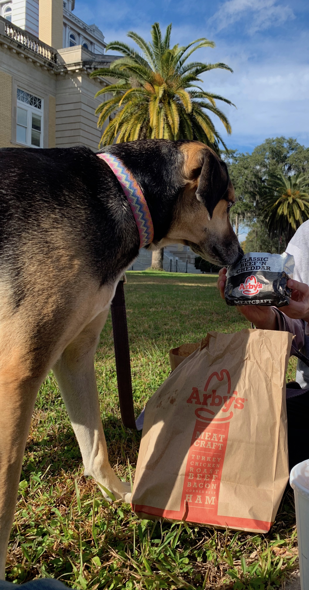

```{r setup, include=FALSE}
knitr::opts_chunk$set(echo = F)
knitr::opts_chunk$set(warning = F)
knitr::opts_chunk$set(message = F)
```


<style>
body {text-align: left}
</style>

___

## 1. Variation in hooman food

Hoomans love their food, and I love to qualitatively assess the variation across hooman food. 

>_I love protein-rich food. Sometimes, pasta is okay._

### Story time 

I remember that one time, when my two favorite hoomans and I were driving from Florida to Arizona. On a sunny day in the middle of nowhere in Florida was nestled this beautiful, rustic town. This was the moment when I first met Arby's. What a beautiful day it was!

```{r, fig.cap="Me and Arbys.", out.width = '50%', fig.align='center'}

```
   
___

## 2. Temporal patterns of food availability

> **Do hooman food availability show circadian rhythms?**

I have been studying the above question for a long time now. However, obtaining funds to publish in current times is hard.

___

## 3. Future directions

* Food availability in urban vs. natural habitats
* Daily association between amount of food available and duration of walk

___
