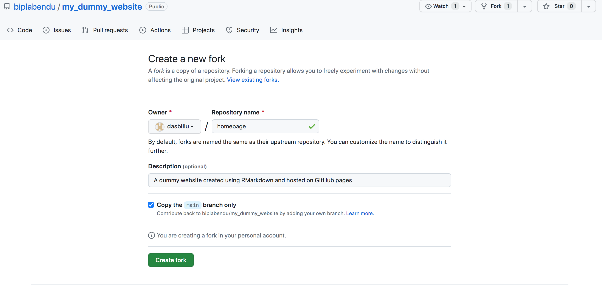
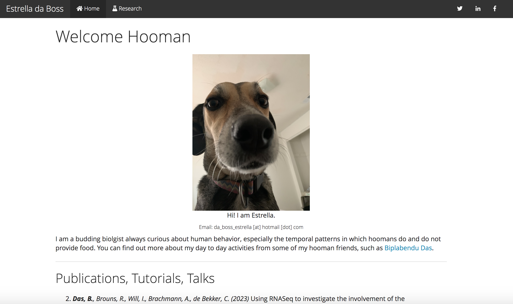
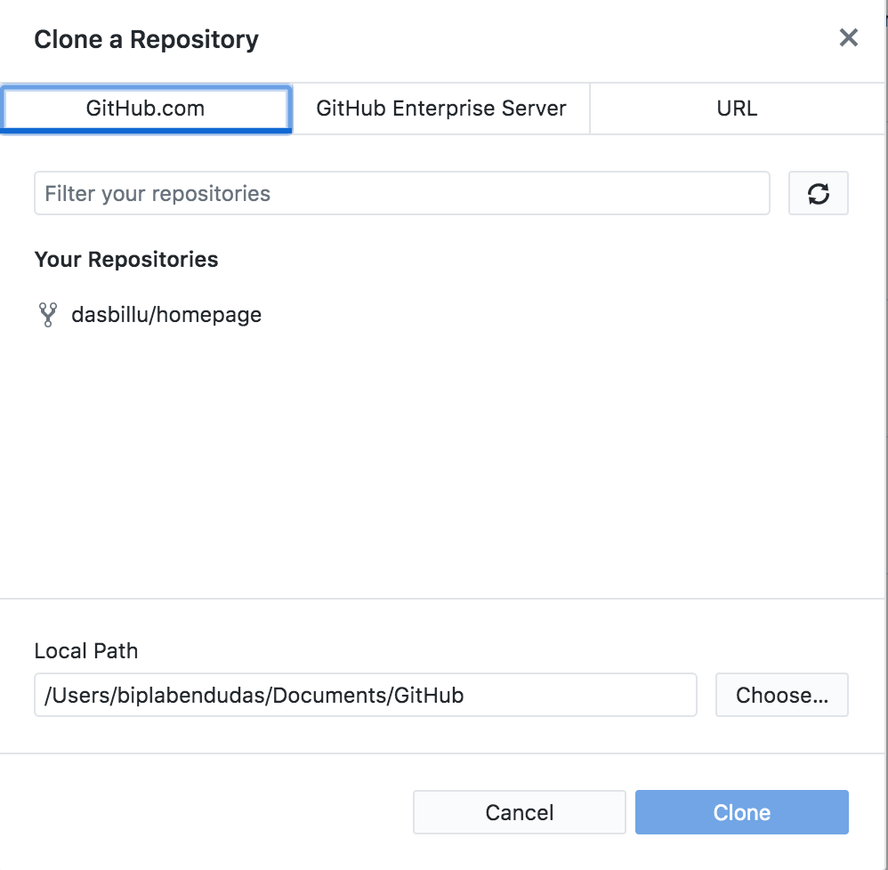

```{r setup, include=FALSE}
knitr::opts_chunk$set(echo = TRUE)
knitr::opts_chunk$set(warning = F)
knitr::opts_chunk$set(message = F)
## For more inspiration on customizing the html output, refer to the following:
# https://bookdown.org/yihui/rmarkdown/html-document.html#table-of-contents
```


<style>
body {text-align: left}
</style>

___

This tutorial shows how to deploy a website, hosted on GitHub Pages for free, using RMarkdown.

To make the process highly accessible, I have created a dummy website that provides a template for building a professional website with two pages: a homepage and a webpage for describing your research experience. The template can be customized for your needs by renaming and repurposing the individual pages.

The process can be broken down to three steps:

1. Make a copy of the website on your GitHub, and deploy it on GitHub Pages.
2. Change the style and content of your html webpages using RMarkdown on your local computer.
3. Update your online website by pushing the local changes to GitHub.

> Every time you make any local changes to your website (Step 2), you need to use step 3 to update it on the web.


## Step 1: Deploy website

### 1.1 Clone the template

We will make a copy of the dummy website by `forking` the repository on GitHub. So, the first thing we need is a registered GitHub account. If you do not have a GitHub account, use the following guidelines to do so:

1. Go to Github and register an account by providing the following information.
  - email: your_email_id
  - password: your_password
  - user name: your_user_name **Pick your username carefully**
  
> The address of your website will be https://your_user_name.github.io/your_project_name

> For example, my user name is biplabendu and my website is deployed as: https://biplabendu.github.io/homepage

2. Go to the GitHub repository for the dummy website: [here](https://github.com/biplabendu/my_dummy_website)

3. Click the `Fork` button on the top-right of the repository, which opens a setup page where you can customize the name of your repository.

4. The name of the repository will be the default name in your website link (see above). Pick something that you like. I will change it to "homepage". Make sure "Copy the main branch only" is checked. Click "Create fork".


```{r, echo=FALSE, fig.cap="Creating a fork.", out.width = '85%', fig.align='center'}

```
 


### 1.2 Deploy the website

1. Go to `Settings`. If you have not changed the name of your repository, I would recommend you do it at this step.

2. Select `Pages` in the `Code and automation` section on the left navigation pane.


```{r, echo=FALSE, fig.cap="Setup GitHub Pages.", out.width = '85%', fig.align='center'}
knitr::include_graphics("./images/02.png")
```
 

3. Check that `Source` is selected as `Deploy from a branch`. Select `Branch` as `main`, which should automatically select `/(root)` as the subfolder. Change `/(root)` to `/docs` because our html files are not in the folder called `docs`. If all looks good, select `Save`.


```{r, echo=FALSE, fig.cap="Deploy website", out.width = '85%', fig.align='center'}
knitr::include_graphics("./images/03.png")
```
 

4. That's it, your website is being created and deployed. If you do not see a link for your website at the top of the `Pages`, please give it a minute and refresh. This might take a couple of minutes.

5. Once your link is ready, click on it and see if it worked. You should arrive at a website with your custom user name and repository name, which looks like below.

```{r, echo=FALSE, fig.cap="Dummy website template.", out.width = '85%', fig.align='center'}

```
 

___

## Step 2: Making modifications

### 2.1 Linking GitHub and RStudio

1. Get a copy of the repository on your local computer using GitHub Desktop. If you don't have it installed on your computer, you can do iter by visiting [this website](https://desktop.github.com/).

2. Open GitHub Desktop and sign in to your account. You might have to allow authorization by clicking the `signing in on the web` option on your login screen.

3. While keeping GitHub Desktop open, click on `File` -> `Clone repository`.

4. A new window opens where you should see your newly created repository. See below.


```{r, echo=FALSE, fig.cap="Create a local clone of your repository", out.width = '85%', fig.align='center'}

```
 

5. Click on the repository with `your_user_name/your_repository_name`, and select a path on your folder where the cloned repository will be saved. Click `Clone`.

6. If everything works fine, your GitHub Desktop should look like below:


```{r, echo=FALSE, fig.cap="GitHub Desktop after cloning is successful", out.width = '85%', fig.align='center'}
knitr::include_graphics("./images/06.png")
```
 

7. There are two ways to access the files of your repository:
  - While on GitHub Desktop, click on the button `View the files of your repository in XXXX` to open the folder.
  - [Preferred way] Create a dedicated folder for all your GitHub repo for easy access and navigation.


### 2.1 Customizing the homepage

> We will use Markdown and R to modify our htmls; each html has an associated `.RMarkdown` file

- the header
- Making hierarchical sections and table of contents
- Highlighting and styling
- Hyperlink
- Pictures and Videos
- create updated html

### 2.2 Adding/Removing webpages

- Create a new `.RMarkdown` file, and generate a html
- Customizing the `_site.yml` file to add/remove a webpage
- Check a local copy of the website to make sure everything looks good

___

## Step 3: Updating website

- Go to GitHub Desktop on your computer, and select `Current Repository` (top-left corner) to `your_repository_name` (for me, it's called `homepage`)
- Select all the changes that you want to push, and write a brief `Summary` (required) of what the changes were. For example, since we added a new page, we can write, `added a new webpage`. You can provide more detailed description of the changes in the field below that says `Description`.


```{r, echo=FALSE, fig.cap="Push changes to GitHub", out.width = '85%', fig.align='center'}
knitr::include_graphics("./images/99.png")
```
 

- Once you are happy with your comments (remember, you are helping future you, so be generous with your descriptions), do the following in the specified order:
    - click `Commit to main`
    - click `Push Origin`
    
> That's it, you are done! Your website will be automatically modified and re-deployed in a couple of minutes (usually less than <5 mins, but depends on the size of your website and amount of changes)


